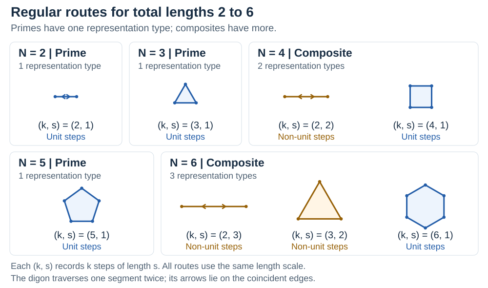

# A Geometric Characterisation of Prime Numbers Using Regular Polygons and Digons

Fix a unit of length and represent a positive integer $N$ by a regular closed route with $k\ge2$ equal steps of integer length $s\ge1$, so $N=ks$. A route is a regular convex polygon, or, when $k=2$, a **degenerate digon**: travel along a segment and retrace it. This short note expresses divisibility through total travelled length and counts every representation type.

By **Pranay Manocha**, independent researcher · October 2026

[Paper (PDF)](paper/prime-geometric-characterisation.pdf) · [LaTeX source](paper/prime-geometric-characterisation.tex) · [References](references.bib)

For every integer **$N\ge2$**,

$$
N\text{ is prime}\iff\text{every admissible route of total length }N\text{ has unit step length}.
$$

Equivalently, the only representation type is $(N,1)$. A route with $s>1$ gives a non-trivial factorisation $N=ks$; conversely, any non-trivial factorisation supplies such a polygon or digon.

## Count the representations

A **representation type** is a pair $(k,s)$, not a placement or orientation of a shape. Each positive divisor $k\mid N$ other than $1$ supplies exactly one type $(k,N/k)$. Therefore, for all positive integers,

$$
R(N)=\tau(N)-1,
$$

where $\tau(N)$ counts positive divisors. This classifies all positive integers:

$$
R(1)=0,\qquad R(p)=1\text{ for primes},\qquad R(N)\ge2\text{ for composites}.
$$



The diagrams use a common length scale. Labels give $(k,s)$; blue means $s=1$ and amber means $s>1$. All artwork is generated in this repository, with no external image dependencies.

## Why include the digon?

The digon distinguishes $2=2\times1$ from $4=2\times2$. The latter is the non-unit route missed if ordinary polygons must have at least three sides. Its segment has length $s$, but the route travels **$2s$**, counting both coincident traversals; the final displacement is zero. For $N=1$ there is no admissible route, so the unit-step criterion must be restricted to $N\ge2$ to avoid vacuous truth.

## Status

This is an **expository mathematical note**, recording an independently developed formulation. It does not claim a new result in number theory or historical priority for this presentation. The motivation was to develop geometric vocabulary before exploring additive questions such as Goldbach's conjecture; **no result concerning Goldbach's conjecture is claimed**.

The construction uses at most two spatial dimensions. It embeds unchanged in every $\mathbb R^n$ with $n\ge2$ and gives no upper bound on mathematical or physical dimensions. This planar case is intended as a starting point for a broader investigation.

## Related descriptions

The paper places this total-length formulation alongside established geometric descriptions:

- **Jenni Way**, [“Multiplication Series: Number Arrays”](https://nrich.maths.org/articles/multiplication-series-number-arrays), NRICH, University of Cambridge (2011): rectangular arrays, factors and primes.
- **Steve Erfle**, [“About Relatively Prime (or Coprime) Numbers”](https://blogs.dickinson.edu/playing-with-polygons/files/2022/02/MA.-Relatively-Prime-1.pdf), *Playing with Polygons*, hosted by Dickinson College (undated): cyclic star drawings and coprimality.
- **T. M. Apostol**, [“Functions of Number Theory,” §27.2, equation 27.2.9](https://dlmf.nist.gov/27.2#E9), *NIST Digital Library of Mathematical Functions*: the divisor-counting function, written $d(n)$ there.

These sources support the stated background; they do not establish priority for this exact formulation.

## Build and check

Run commands from the repository root. The vector figures are committed, so building the paper needs only a standard LaTeX installation with BibTeX:

```sh
pdflatex -interaction=nonstopmode -halt-on-error -output-directory=paper paper/prime-geometric-characterisation.tex
bibtex paper/prime-geometric-characterisation
pdflatex -interaction=nonstopmode -halt-on-error -output-directory=paper paper/prime-geometric-characterisation.tex
pdflatex -interaction=nonstopmode -halt-on-error -output-directory=paper paper/prime-geometric-characterisation.tex
```

On Windows, `powershell -File scripts/build.ps1` runs the same sequence and stops if a command fails.

To regenerate the diagrams with Python 3:

```sh
python -m pip install -r requirements.txt
python scripts/make_figures.py
```

The generator renders a shared geometric description to standalone SVGs and matching vector PDFs. Check the examples and finite arithmetic independently with the standard library:

```sh
python scripts/check_math.py
```

The checks supplement the proofs; finite computation is not their justification.

## Licence and citation

Copyright © 2026 Pranay Manocha. The paper, LaTeX source, README, bibliography and figures are licensed under [Creative Commons Attribution 4.0 International](https://creativecommons.org/licenses/by/4.0/); the full text is in [LICENSE](LICENSE). The supporting Python and PowerShell scripts use the [MIT licence](LICENSE-CODE). Referenced works retain their own terms.

To cite the note, use the author, title, 2026 and repository URL. Machine-readable citation metadata is supplied in [CITATION.cff](CITATION.cff).
